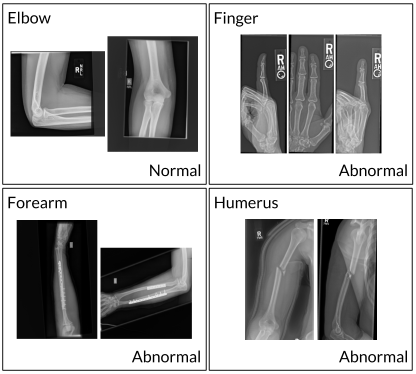
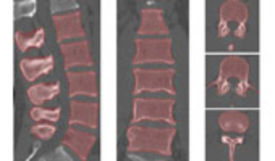

# Tutorial - Deep Learning in Medical Imaging 

- **Tutorial 1 - Data Pipelining**
- **Tutorial 2 - Classifiacation (MURA v1.0)**
- **Tutorial 3 - Advanced Classifiacation (MURA v1.0)**
- **Tutorial 4 - Segmentation (Lumbar vertebra segmentation CT image database)**
- **Tutorial 5 - Advanced Segmentation (Lumbar vertebra segmentation CT image database)**

## Install Requirements

- python 3.6
- keras
```
pip3 install -r requirements.txt
```

## Open Datasets (License Required)

- MURA Dataset (v-1.0) for Classification
---



[MURA] (https://stanfordmlgroup.github.io/competitions/mura/)

[Journal] (https://arxiv.org/abs/1712.06957)


---
- Lumbar vertebra segmentation CT image database




[SpineWeb Dataset 5] (http://spineweb.digitalimaginggroup.ca/spineweb/index.php?n=Main.Datasets#Dataset_7.3A_Intervertebral_Disc_Localization_and_Segmentation.3A_3D_T2-weighted_Turbo_Spin_Echo_MR_image_Database)

## Slide

- Tutorial 1 : 'Introduction to Medical Image Analysis and Processing'

[Slideshare] (https://www.slideshare.net/ssuser421e61/modulab-dlcmedical)

- Tutorial 2 : N/A

- Tutorial 3 : 'Auto ML'

[Slideshare] (https://www.slideshare.net/ssuser421e61/modulab-dlcmedical3)

- Tutorial 4 : 'Semantic Segmentation'

[Slideshare] 

- Tutorial 5 : 'Grand Challenges in Biomedical Imaging Analysis (Surgical Workflow Analysis in the SensorOR)'

[Slideshare] 


## License

This project is licensed under the MIT License - see the [LICENSE.md](LICENSE.md) file for details

## Contact

dhlee@melab.snu.ac.kr

